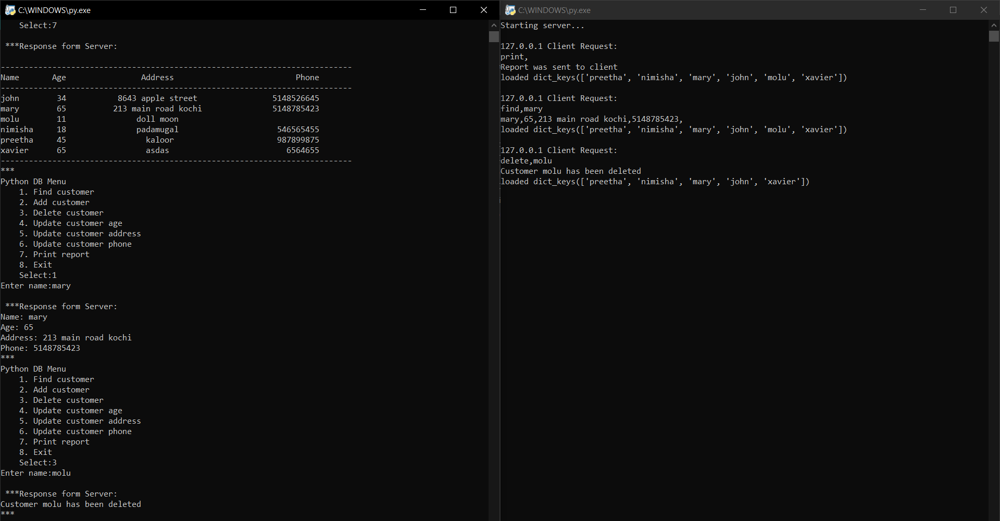

# DBSystem
A small database server in python for mangaing customer data.

## Screenshots

## Running instructions:-
* start server.py
* start client.py
* follow prompts

## Tools and Technology
* [Socket programming](https://docs.python.org/3/library/socketserver.html)
